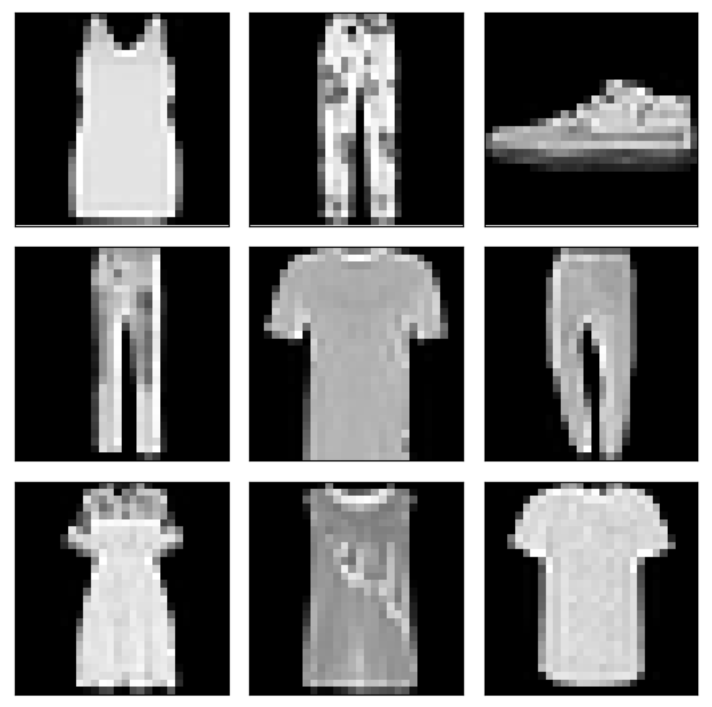
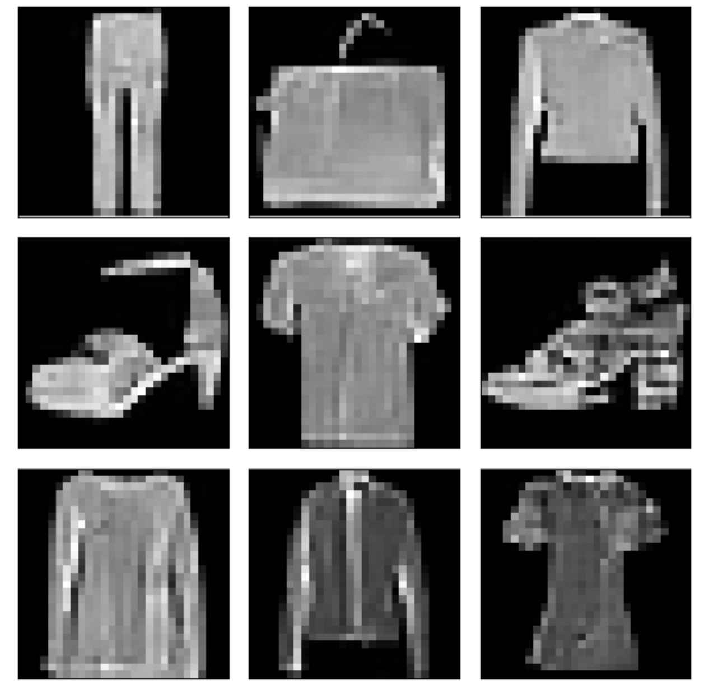

# Denoising Diffusion Probabilistic Model
This repo contains simple reimplementation of Denoising Diffusion Probabilistic Model paper: [Ho et al](https://arxiv.org/abs/2006.11239)

## Data
Following [[1]](#1) we used Fashion MNIST dataset.


## Setup
#### Pip
`pip install -r requirements.txt`
#### Docker
1. `docker build -t ddpm .`
2. `docker run -it ddpm`

## Training
`python src/train.py`

There is a couple of settings you may want to specify:
- `--batch_size` - set depending on your gpu memory available
- `--num_epochs` - num epoch to train the model
- `--diffusion_timesteps` - how many diffusion steps to make

## Inference
Load checkpoint (check Releases).

Run the following code:
```python
from src.diffusion import GaussianDiffusion, linear_beta_schedule
from src.unet import Unet
import torch

import matplotlib.pyplot as plt

unet = Unet(channels=1, dim_mults=(1, 2, 4), dim=28)
checkpoint = torch.load("<checkpoint-path>")
unet.load_state_dict(checkpoint["model_state_dict"])
unet.to("cuda:1")

timesteps = 300
diffusion = GaussianDiffusion(noise_schedule=linear_beta_schedule, timesteps=timesteps)

result = diffusion.sample(model=unet, image_size=28, batch_size=64, channels=1)

image_index = 8
image = (res[-1][image_index] + 1) * 0.5
plt.imshow(image.reshape(28, 28, 1), cmap="gray")
```

You can also use DDIM sampling [[4]](#4). To do that, modify the example in the following way:
```python
from src.diffusion import SamplingMethod

result = diffusion.sample(
    model=unet,
    image_size=28,
    batch_size=64,
    channels=1,
    sampling_method=SamplingMethod.DDIM
)
```

## Results

<p><em>Fashion MNIST dataset samples</em></p>
<p>
    
</p>
<p><em>Generated samples</em></p>
<p>

</p>

## References
<a id="1">[1]</a>
[The Annotated Diffusion Model.](https://huggingface.co/blog/annotated-diffusion)

<a id="2">[2]</a>
[Denoising Diffusion Probabilistic Model, in Pytorch.](https://github.com/lucidrains/denoising-diffusion-pytorch/tree/main)

<a id="3">[3]</a>
[Denoising Diffusion Probabilistic Models (DDPM).](https://nn.labml.ai/diffusion/ddpm/index.html)

<a id="4">[4]</a>
[Denoising Diffusion Implicit Models (DDIM).](https://arxiv.org/abs/2010.02502)
